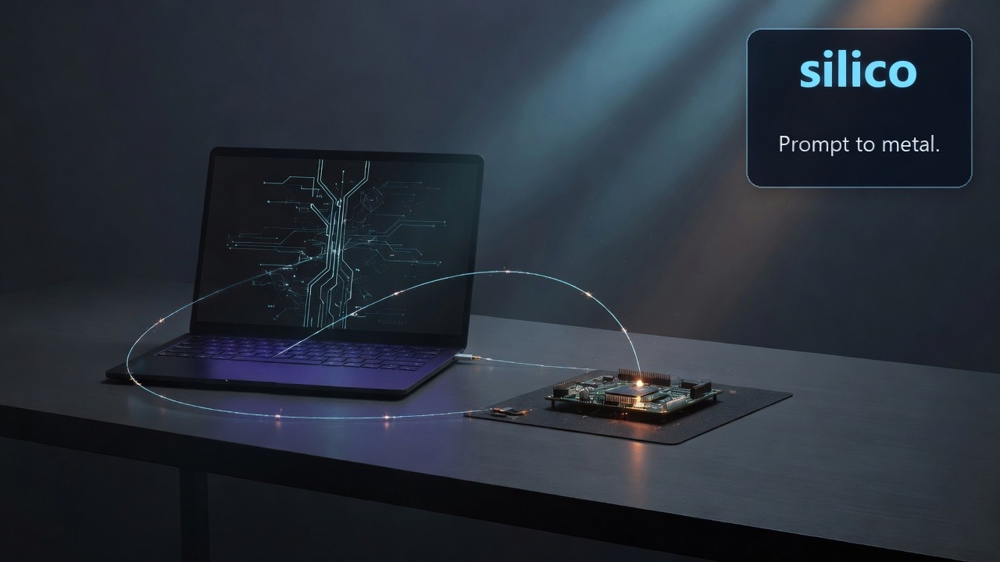

**Prompt for metal.**

Silico makes building maintainable firmware for embedded devices simple. Given a device spec, it first guides AI agents to scaffold a Github repository setup for long-term maintainability. Agents then loop to engineer robust firmware, unit and smoke tests, a simulator, ci/cd using both real devices and the simulator, and an end-user installer/ugrader.

The human interface is a coding agent; not an installation guide or shell tutorial. To start, open your coding agent and say:

```md
See https://github.com/tig/silico. Follow the getting started instructions for agents.
```

The agent owns the host path: prerequisites, GitHub setup, scaffolding, testing, device discovery, deployment, and verification. You own the
product judgment and confirm physical or irreversible actions. 

### Supported platforms (host spine)

Same operator verbs (`doctor`, `wait-device`, `inspect`, `deploy`, `gate`, …). Runtime is selected in `silico.toml` / plate.

| MCU class | Device runtime | First flash | App update | Plate |
|-----------|----------------|-------------|------------|--------|
| **RP2040-class** | MicroPython | UF2 (once) | `mpremote` file copy | `silico scaffold .` (default `gcu`) |
| **ESP32-class** | MicroPython | esptool (once) | `mpremote` file copy | default `gcu` + ESP board pin |
| **ESP32-class** | **C / ESP-IDF** | esptool / `idf.py flash` | same image path | `silico scaffold . --plate gcu-c` |

Default for new GCUs remains **MicroPython**. C on ESP-IDF is opt-in when a product needs native firmware against the same host path.

### Not silico dual-runtime paths (yet)

These may appear *inside* a GCU’s own tree; they are **not** first-class silico plates or `[runtime].language` values:

- **Arduino** core / `arduino-cli` as the Day 1 deploy backend ([issue #59](https://github.com/tig/silico/issues/59)).
- **PlatformIO** as the silico deploy path.
- **Pico SDK (C)** as a silico language peer (only if an RP2040 GCU forces it later).
- **`language = cpp`** as a third peer next to MicroPython and C (C++ may live in ESP-IDF board TUs; host-gated domain stays portable C by default).

Agents write the firmware. You own the judgment.

## We work backwards from this:

> With just Claude Code on my Mac, I had the device working end-to-end the next day, and in a potential customer's hand the day after that. Silico is now a foundational piece of our company's technology.

Agents write the firmware. You own the judgment.

A **GCU** (General Contact Unit) is one shippable edge product. Silico is the spine those products pin on the host - not the product itself.

| Doc | Who |
|-----|-----|
| [AGENTS.md](AGENTS.md) | Agents (Day 1 getting started) |
| [BEDSIDE.md](BEDSIDE.md) | Operator domain notes (metal); pin [Bedside](https://github.com/tig/bedside) via vendored contract |
| [specs/wb-2026-fall-three-gcus.md](specs/wb-2026-fall-three-gcus.md) | Humans: v1 PR + FAQ |
| [specs/tenets.md](specs/tenets.md) | Tenets |
| [specs/lexicon.md](specs/lexicon.md) | Phrase book (GCU, spine, host-honest, Help the operator, …) |
| [specs/silicov1.md](specs/silicov1.md) | v1 build spec |
| [specs/gcu-codenames.md](specs/gcu-codenames.md) | Public GCU codenames |
